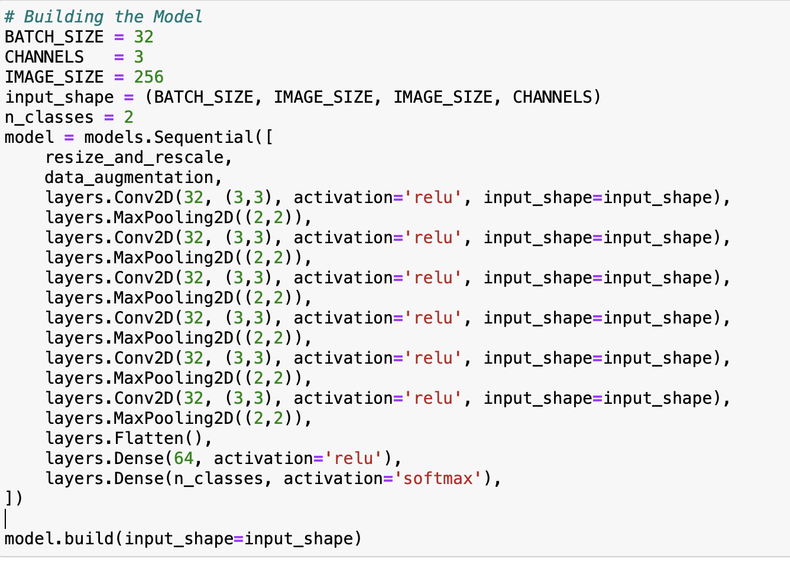
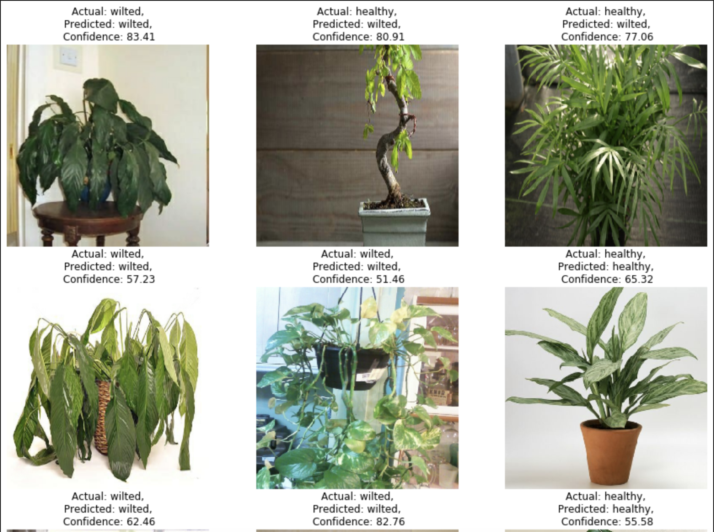

# Houseplant-Healthy

<!--  -->
<p align="center">
  
</p>

Houseplant Health Check is a project that helps you keep your houseplants healthy and thriving. It employs deep learning techniques to analyze plant images, serves the model using TensorFlow Serving, provides a FastAPI backend for predictions, and has a Node.js frontend for a user-friendly interface.

<!-- ## Installation

1. Clone the repository:

   	```bash
   	git clone https://github.com/bhargobdeka/houseplant-healthy.git

   	```

2. Change to the directory:

	```bash
	cd houseplant-healthy

	```
## Model




## Results
 -->
